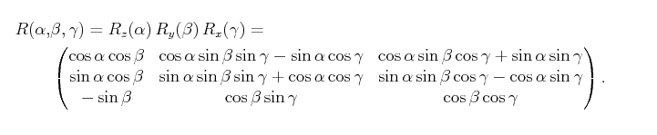

The motion models we implement predict a state where the velocity/aceleration parts are all car-frame based whereas absolute values like pose and orientation are world-frame base.

We want to allow both 2D and 3D based motion models. In difference to robot_localization library we don't always use the same 3D motion model and project it in 2D if necessary but allow the usage of different 2D/3D motion models. The motivation is saving up computations for the 2D case and allowing the motion model choice to be generic.

# Design

The motion model serves as an interface which:
- provides a mean to predict the state vector according to the model from the actual state and a delta_time
- provides the computation of the process jacobian on a given state and delta_time

Some considerations for the motion model:
- it doesn't own any member variable
- the outputs are given per reference to avoid unecesasry copying of matrixes
- to avoid compuation-order errors for the Jacobian-predict step and to save some computation we ofer
a method that does both `compute_jacobian_and_predict()`.

## Input / Outputs / API
The following inputs are provided:
- State (i.e. `predict()`, `compute_jacobian()`, `compute_jacobian_and_predict()`)
- Time increment (i.e. `predict()`, `compute_jacobian()`, `compute_jacobian_and_predict()`)

The following outputs are provided:
- State (i.e. `predict()`, `compute_jacobian_and_predict()`)
- Jacobian (i.e. `compute_jacobian()`, `compute_jacobian_and_predict()`)

## 2D Models
### CTRV (Constant turning rate and velocity)
This is a nonlinear motion model. It assumes constant velocity, i.e. accelerations arent considered at all and velocity changes
can come only from the sensors directly.

The CTRV motion model has the following state:
```c
x   // x position
y   // y position
yaw // orientation
vx  // x velocity
vy  // y velocity
vyaw// turning rate
```

With the following update equations:
```c
x = x + dt*vx*cos(yaw) - dt*vy*sin(yaw)
y = y + dt*vx*sin(yaw) + dt*vy*cos(yaw)
yaw = yaw + dt*vyaw
vx = vx
vy = vy
vyaw = vyaw
```

Resulting in the following jacobian:
```c
1  0  -dt*vx*sin(yaw)-dt*vy*cos(yaw)  dt*cos(yaw)  -dt*sin(yaw)  0
0  1  dt*vx*cos(yaw)-dt*vy*sin(yaw)   dt*sin(yaw)  dt*cos(yaw)   0
0  0  1                               0            0             dt
0  0  0                               1            0             0
0  0  0                               0            1             0
0  0  0                               0            0             1
```

### CTRA (Constant turning rate and acceleration)
This nonlinear motion momdel assumes constant turn rate and acceleration. The turn rate is assumed to be independendt of all
other parameters, such as velocity or acceleraion.


The CTRA motion model has the following state:
```c
x   // x position
y   // y position
yaw // orientation
vx  // x velocity
vy  // y velocity
vyaw// turning rate
ax  // x acceleration
ay  // y acceleration
```

With the following update equations:
```c
x = x + dt*vx*cos(yaw) - dt*vy*sin(yaw) + 0.5*dt^2*ax*cos(yaw) - 0.5*dt^2*ay*sin(yaw)
y = y + dt*vx*sin(yaw) + dt*vy*cos(yaw) + 0.5*dt^2*ax*sin(yaw) + 0.5*dt^2*ay*cos(yaw)
yaw = yaw + dt*vyaw
vx = vx + dt*ax
vy = vy + dt*ay
vyaw = vyaw
ax = ax
ay = ay
```

Resulting in the following jacobian:
```c
1  0  -dt*vx*sin(yaw)-dt*vy*cos(yaw)-0.5*dt^2*ax*sin(yaw)-0.5*dt^2*ay*cos(yaw)  dt*cos(yaw)  -dt*sin(yaw)  0   0.5*dt^2*cos(yaw)  -0.5*dt^2*sin(yaw)
0  1  dt*vx*cos(yaw)-dt*vy*sin(yaw)+0.5*dt^2*ax*cos(yaw)-0.5*dt^2*ay*sin(yaw)   dt*sin(yaw)  dt*cos(yaw)   0   0.5*dt^2*sin(yaw)  0.5*dt^2*cos(yaw)
0  0  1                                                                         0            0             dt  0                  0
0  0  0                                                                         1            0             0   dt                 0
0  0  0                                                                         0            1             0   0                  dt
0  0  0                                                                         0            0             1   0                  0
0  0  0                                                                         0            0             0   1                  0
0  0  0                                                                         0            0             0   0                  1
```

## 3D Models
### CTRA (Constant turning rate and acceleration)
This model follows the same logic as the 2D motion model to extend the model for the 3d dimension(z-direction).
The derivations get more complicated as we now have 2 more directions to consider. As the Jacobian gets very big the derivations are left as an exercise for the reader.

The CTRA3d motion model has the following state:
```c
x       // x position
y       // y position
z       // z position
roll    // x orientation
pitch   // y orientation
yaw     // z orientation
vx      // x velocity
vy      // y velocity
vz      // z velocity
vroll   // x turning rate
vpitch  // y turning rate
vyaw    // z turning rate
ax      // x acceleration
ay      // y acceleration
az      // z acceleration
```

With the following update equations:
```c
cr := cos(cr)
cp := cos(cp)
cy := cos(cy)
sr := sin(sr)
sp := sin(sp)
sy := sin(sy)
tp := tan(pitch)
```

```c
x = x + dt*vx*cy*cp + dt*vy*(cy*sp*sr-sy*cr) + dt*vz*(cy*sp*cr+sy*sr) + 0.5*dt^2*ax*cy*cp + 0.5*dt^2*ay*(cy*sp*sr-sy*cr) + 0.5*dt^2*az*(cy*sp*cr+sy*sr)
y = y + dt*vx*sy*cp + dt*vy*(sy*sp*sr+cy*cr) + dt*vz*(sy*sp*cr-cy*sr) + 0.5*dt^2*ax*sy*cp + 0.5*dt^2*ay*(sy*sp*sr+cy*cr) + 0.5*dt^2*az*(sy*sp*cr-cy*sr)
z = z + -dt*vx*sp + dt*vy*cp*sr + dt*vz*cp*cr + 0.5*dt^2*ax*sp + 0.5*dt^2*ay*cp*sr + 0.5*dt^2*az*cp*cr
roll = roll + dt*vroll + dt*sr*tp*vpitch + dt*cr*tp*vyaw
pitch = pitch + dt*cr*vpitch - dt*sr*vyaw
yaw = yaw + dt*sr/cp*vpitch + dt*cr/cp*vyaw
vx = vx + dt*ax
vy = vy + dt*ay
vz = vz + dt*az
vroll = vroll
vpitch = vpitch
vyaw = vyaw
```

Resulting in the following jacobian:
```c
dx/droll = dt*vx*0 + dt*vy*(cy*sp*cr+sy*sr) + dt*vz*(-cy*sp*sr+sy*cr) + 0.5*dt^2*ax*0 + 0.5*dt^2*ay*(cy*sp*cr+sy*sr) + 0.5*dt^2*az*(-cy*sp*sr+sy*cr)
dx/dpitch = -dt*vx*cy*sp + dt*vy*cy*cp*sr + dt*vz*cy*cp*cr - 0.5*dt^2*ax*cy*sp + 0.5*dt^2*ay*cy*cp*sr + 0.5*dt^2*az*cy*cp*cr 
dx/dyaw = -dt*vx*sy*cp + dt*vy*(-sy*sp*sr-cy*cr) + dt*vz*(-sy*sp*cr+cy*sr) - 0.5*dt^2*ax*sy*cp + 0.5*dt^2*ay*(-sy*sp*sr-cy*cr) + 0.5*dt^2*az*(-sy*sp*cr+cy*sr)

dy/droll = dt*vx*0 + dt*vy*(sy*sp*cr-cy*sr) + dt*vz*(-sy*sp*sr-cy*cr) + 0.5*dt^2*ax*0 + 0.5*dt^2*ay*(sy*sp*cr-cy*sr) + 0.5*dt^2*az*(-sy*sp*sr-cy*cr)
dy/dpitch = -dt*vx*sy*sp + dt*vy*sy*cp*sr + dt*vz*sy*cp*cr - 0.5*dt^2*ax*sy*sp + 0.5*dt^2*ay*sy*cp*sr + 0.5*dt^2*az*sy*cp*cr
dy/dyaw = dt*vx*cy*cp + dt*vy*(cy*sp*sr-sy*cr) + dt*vz*(cy*sp*cr+sy*sr) + 0.5*dt^2*ax*cy*cp + 0.5*dt^2*ay*(cy*sp*sr-sy*cr) + 0.5*dt^2*az*(cy*sp*cr+sy*sr)

dz/droll = -dt*vx*0 + dt*vy*cp*cr - dt*vz*cp*sr + 0.5*dt^2*ax*0 + 0.5*dt^2*ay*cp*cr - 0.5*dt^2*az*cp*sr
dz/dpitch = -dt*vx*cp - dt*vy*sp*sr - dt*vz*sp*cr + 0.5*dt^2*ax*cp - 0.5*dt^2*ay*sp*sr - 0.5*dt^2*az*sp*cr
dz/dyaw = -dt*vx*0 + dt*vy*0 + dt*vz*0 + 0.5*dt^2*ax*0 + 0.5*dt^2*ay*0 + 0.5*dt^2*az*0


droll/droll = dt*cr*tp*vpitch - dt*sr*tp*vyaw;
droll/dpitch = dt*sr/cp^2*vpitch + dt*cr/cp^2*vyaw;
droll/dyaw = dt*0*vpitch + dt*0*vyaw;

dpitch/droll = -dt*sr*vpitch - dt*cr*vyaw
dpitch/dpitch = dt*0*vpitch - dt*0*vyaw
dpitch/dyaw = dt*0*vpitch - dt*0*vyaw

dyaw/droll = dt*cr/cp*vpitch - dt*sr/cp*vyaw
dyaw/dpitch = dt*sr*tp/cp*vpitch + dt*cr*tp/cp*vyaw
dyaw/dyaw = dt*0*vpitch + dt*0*vyaw
```

# References / External links
- http://fusion.isif.org/proceedings/fusion08CD/papers/1569107835.pdf
- https://perso.uclouvain.be/georges.bastin/paper37.pdf


# Extra
For an easier understanding, the transformations that occur to the velocities and accelerations are rotations which in the general(3D) case can be described by the rotation matrix:





where alpha=yaw, beta=pitch and gamma=roll.