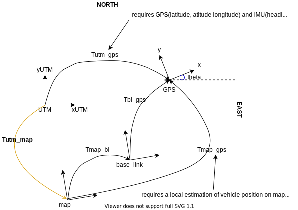

GPS msgs come in form of longitude, latitude und altitude. In order to be able to fuse such measurements we should be able to transform them in a local world fixed cartesian coordinate system.

We're interested in a transform from lat/long coordinates to our robot's map frame.
As we don't want to deal directly with lat/longs, the first thing is to convert the lat/long coordinates into [UTM](https://en.wikipedia.org/wiki/Universal_Transverse_Mercator_coordinate_system) coordinates.
This gives us our GPS location in a Cartesian coordinate frame. As I understand this coordinate system corerspond to small regions(~around 360km) and have to be changed if we pass to a new region. For example in [Germany](https://en.wikipedia.org/wiki/Universal_Transverse_Mercator_coordinate_system#/media/File:LA2-Europe-UTM-zones.png) we have 32U and 33U. Nevertheless I assume for now that this coordinate system is fixed. In addition to that I assume as in robot_localization that this coordinate system has an ENU orientation(x-east, y-north, z-up)




What we want to know is the position and orientation of our robot's world frame in the UTM grid. That corresponds on knowing **T_map_utm**, so that every position given in UTM frame can transformed into map frame by multiplying: **x_map = T_map_utm * x_utm**.

How to find this transformation **T_map_utm**?

We can find this transformation as long as we know one of the transformations from **T_utm_x** where **x** can be any of the frames connected to map and gps frame, i.e. we have already estimated **T_map_x**.  So we can just write: **T_map_utm = T_map_x * T_utm_x^-1**.
This **x** in our case would be the the gps frame, so **T_map_utm = T_map_gps * T_utm_gps^-1**.
1. **T_map_gps**: can be acquired from the pose estimation of the vehicle in map frame (**T_map_bl**) and the pose of the sensor in vehicle frame(**T_bl_gps**) as **T_map_gps= T_map_bl * T_bl_gps**.

2. **T_utm_gps**: is a litle harder to get. First of all from the information that we get from the GPS sensor can be converted only into a position without orientation (**P_utm_gps**). But in order to create the full transformation we require third orientation. This orientation should be either provided through a configuration file or provided by an IMU sensor.
For the second case this translates to knowing **R_enu_imu**. Since the UTM and ENU are assumed to have the same orientation we have **R_utm_imu = R_enu_imu**. So **R_utm_gps = R_utm_imu * R_imu_gps** where **R_imu_gps** is given since we know the orientations of both IMU and GPS relative to the vehicle frame(base_link).

This transformation **T_map_utm** can then used to interpret all positions provided by the GPS in map frame.

So no mater of the cases [(a)&(b)](https://github.com/cra-ros-pkg/robot_localization/issues/550#issuecomment-606466118)  where the vehicle starts with an offset angle from the ENU or the vehicle is in a GPS-denied area for some time, and get its first GPS reading when it is at some later pose in the map we should be able to still treat the problem the same.

**Note**: as both orientation from IMU and position from GPS are absolute we could even average multiple estimations of **T_map_utm** in order to avoid any unwanted bias.

## Configuration
Instead of using the first GPS location and IMU-based heading for the local-frame origin, users can specify the
origin (datum) using this parameter. The fields in the parameter represent latitude and longitude in decimal degrees,
and heading in radians. As navsat_transform_node assumes an ENU standard, a 0 heading corresponds to east.
```
datum: [55.944904, -3.186693, 0.0]
```