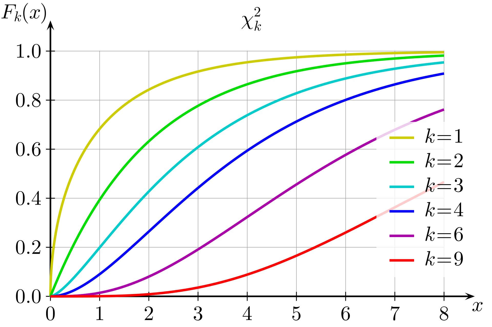

Giving a sensor i and its innovation νi(k) ∈ Rn associated, the following relation is formed

**qi = νTi(k) Si-1(k) νi(k)**
with  **Si(k) = HiP(k|k − 1)HTi + Ri(k)**.

Where **qi** ∈ R+  is a Chi (X2) distribution with n degrees of freedom.
Plot of the Chi distribution and its cumulative distribution for different DOF is given in the figures below:

For example, considering innovations **νi(k) ∈ R3**  with 3 DOFs and probability less than the critical value 95% and an innovation then the Mahalanobis distance should be **ti = 7.815, above which all samples should be ignored**. So, depending on the confidence level and the dimension of the measurement we can choose the Mahalanobis distance **ti**.

As we allow the user to ignore parts of the measurement, we require a dynamic adaption of the Mahalanobis distance which makes the matter more complicated.

But in general if **no measurements are ignored**, we should have:

|        | Odom(12DOF) | Imu(3DOF)| GPS(3DOF) |
|----      |----    |----   |----   |
| **90%**  | 18.549 | 6.251 | 6.251 |
| **95%**  | 21.026 | 7.815 | 7.815 |
| **97.5%**| 23.337 | 9.348 | 9.348 |

Distances for different nr of DOF can be found in [here](https://www.itl.nist.gov/div898/handbook/eda/section3/eda3674.htm).